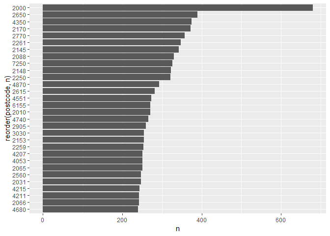

``` r
knitr::opts_chunk$set(echo = TRUE, message = FALSE, warning = FALSE)

library(tidyverse)
library(readxl)
library(lubridate)
library(here)
```

Import
======

``` r
donors <- read_csv(here("data/raw/donors.csv"), 
                   col_types = cols(
                     id = col_character(),
                     state = col_character(),
                     postcode = col_character(),
                     dateofbirth = col_character(),
                     gender = col_character(),
                     FirstContributionDate = col_character(),
                     LastContributionDate = col_character()
                   )) %>%
  mutate(gender = factor(gender),
         state = factor(state)) %>%
  mutate_at(vars(dateofbirth, FirstContributionDate, LastContributionDate),
            function(v) {
              str_remove(v, " .*$") %>%
                ymd %>%
                na_if(ymd("1901-01-01"))
              })
```

Basic cleaning and feature engineering.
---------------------------------------

-   Compute age
-   Compute donor frequency
    -   Once only
    -   More than once
-   Compute days since last donation
-   Create a logical to denote if female and under 35 (our target
    persona, based on teammates’ exploration)

``` r
donors_clean <- donors %>%
  mutate(age = (today() - dateofbirth) / 365 %>% as.numeric,
         freq = factor(case_when(FirstContributionDate == LastContributionDate ~ "Once",
                                 FirstContributionDate != LastContributionDate ~ "More than once")),
         recency = today() - LastContributionDate,
         active = case_when(recency < 365 ~ "Active",
                            recency > 365 ~ "Inactive"),
         f_under35 = case_when(gender == "Female" & age < 35 ~ TRUE,
                               TRUE ~ FALSE))  %>%
  filter(! age > 110, ! age < 15,
         ! postcode == "NULL") 
```

``` r
donors %>%
  filter(postcode != "NULL") %>%
  group_by(postcode, ) %>%
  tally %>%
  top_n(30) %>%
  arrange(n) %>%
  mutate(postcode, factor(postcode) %>% reorder(-n)) %>%
  ggplot(aes(x = reorder(postcode, n), y = n)) +
  geom_bar(stat = "identity") +
  coord_flip()
```



``` r
donors_clean %>%
  ggplot(aes(age)) +
  geom_histogram(breaks = c(seq(0, 100, 10)))
```


``` r
donors_clean %>%
  ggplot(aes(recency)) +
  geom_histogram()
```


``` r
summary(donors_clean)
```

    ##       id                state         postcode        
    ##  Length:56195       NSW    :24134   Length:56195      
    ##  Class :character   QLD    :11178   Class :character  
    ##  Mode  :character   VIC    : 7430   Mode  :character  
    ##                     WA     : 6447                     
    ##                     SA     : 2164                     
    ##                     TAS    : 2161                     
    ##                     (Other): 2681                     
    ##   dateofbirth                    gender      FirstContributionDate
    ##  Min.   :1909-11-13   Female        :29448   Min.   :1900-01-01   
    ##  1st Qu.:1959-07-21   Male          :25877   1st Qu.:2009-07-30   
    ##  Median :1975-03-25   Not Applicable:    0   Median :2013-12-30   
    ##  Mean   :1971-12-30   Unknown       :  870   Mean   :2011-12-03   
    ##  3rd Qu.:1987-08-28                          3rd Qu.:2016-05-31   
    ##  Max.   :2003-05-22                          Max.   :2018-11-15   
    ##                                                                   
    ##  LastContributionDate     age                       freq      
    ##  Min.   :2014-01-02   Length:56195      More than once:50213  
    ##  1st Qu.:2015-12-30   Class :difftime   Once          : 5982  
    ##  Median :2017-10-30   Mode  :numeric                          
    ##  Mean   :2017-04-24                                           
    ##  3rd Qu.:2018-10-30                                           
    ##  Max.   :2018-11-19                                           
    ##                                                               
    ##    recency            active          f_under35      
    ##  Length:56195      Length:56195       Mode :logical  
    ##  Class :difftime   Class :character   FALSE:46968    
    ##  Mode  :numeric    Mode  :character   TRUE :9227     
    ##                                                      
    ##                                                      
    ##                                                      
    ## 

Output for T
============

Enumerate target persona by postcode, and write to CSV to share with
teammates.

``` r
postcodes <- donors_clean %>%
  group_by(postcode, f_under35) %>%
  tally %>%
  filter(f_under35) %>%
  arrange(-n) %>%
  select(-f_under35)

write.csv(postcodes, here("data/clean/f_under30.csv"))
```

Emergency join
==============

Relies on data supplied by teammates - joining target persona count to
service locations. Compute crude score (no modeling yet).

``` r
services <- read_csv(here("data/clean/services.csv")) %>%
  rename(postcode = Postcode,
         service_n = `Count of Primary/Satellite`)

scores <- postcodes %>%
 inner_join(services, by = "postcode") %>%
  mutate(score = 0.7 * n + 0.3 * service_n) %>%
  arrange(-score)

write.csv(scores, here("data/clean/scores.csv"))
```
